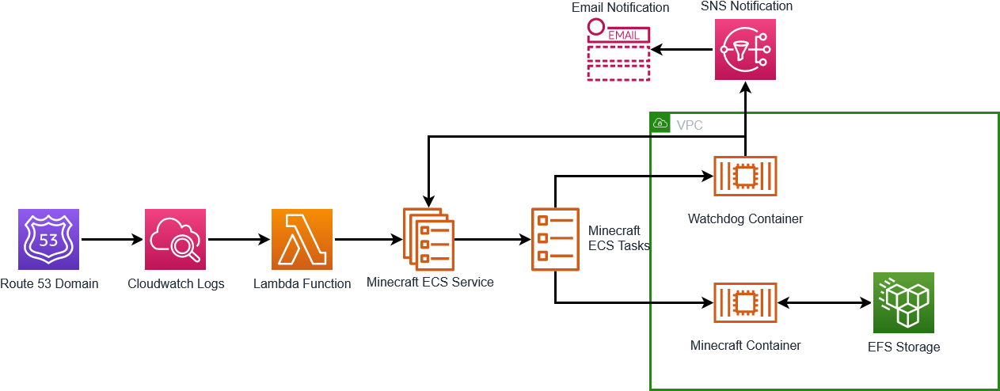

# Minecraft CDK Deployment using AWS Fargate

This repo will deploy an AWS Fargate based Minecraft server that uses Route 53 to update the service and activate the Minecraft server.

Much of the work here is based on the work by [doctorrat117](https://github.com/doctorray117) from [minecraft-ondemand](https://github.com/doctorray117/minecraft-ondemand).

## Overview



## .env File

The .env file used by this deployment includes several variables that will be referenced later. A sample .env file is included: [.env.sample](/.env.sample) and should be updated and renamed to `.env`.

```
MINECRAFT_EDITION = 'java'
SERVER_SUBDOMAIN = 'minecraft'
DOMAIN = 'example.com'
HOSTED_ZONE_ID = 'Z00000000000000000000'
MEMORY_SIZE = '8192'
CPU_SIZE = '4096'
SNS_EMAIL = 'admin@example.com'
STARTUP_MIN = '10'
SHUTDOWN_MIN = '20'
DEBUG = 'true'
```

A Route 53 domain and Hosted Zone ID is required for this deployment. These will be used to start the service.

## Quick Start

```sh
# might need to use a different authentication mechanism
aws configure sso
yarn
yarn build
yarn deploy
```

### AWS Fargate Service

This deployment uses an AWS Fargate service to deploy two containers - the Minecraft server and a watchdog server. The Minecraft server is the reason for deploying this and will be used to play the game. The watchdog container is used to ensure that the Minecraft server is still being used.

#### Starting the Service

To start the service and allow someone to use the Minecraft server, a query to `SERVER_SUBDOMAIN`.`DOMAIN` will result in Route 53 updating Cloudwatch logs. This Cloudwatch log will trigger an AWS Lambda Function to set the `desired-count` of the Fargate service to 1.

```python
    if desired == 0:
        ecs.update_service(
            cluster=CLUSTER,
            service=SERVICE,
            desiredCount=1,
        )
        print("Updated desiredCount to 1")
    else:
        print("desiredCount already at 1")
```

By setting the `desired-count` to 1, the containers in the ECS service will be activated and available. The AWS ECS Service includes the Minecraft server container and a watchdog container. Both of these will be started when the `desired-count` is set to 1.

```typescript
this.service = new FargateService(this, 'FargateService', {
  serviceName: 'MineCraftService',
  cluster: this.cluster,
  capacityProviderStrategies: [
    {
      capacityProvider: 'FARGATE',
      weight: 1,
      base: 1,
    },
  ],
  taskDefinition: this.task,
  assignPublicIp: true,
  desiredCount: 0,
  vpcSubnets: { subnetType: SubnetType.PUBLIC },
  securityGroups: [props.securityGroup],
  enableExecuteCommand: true,
});

const minecraftServerContainer = this.task.addContainer(
  'MinecraftServerContainer',
  {
    image: ContainerImage.fromRegistry(props.serverConfig.image),
    environment: {
      EULA: 'TRUE',
      MEMORY: '8G',
    },
    portMappings: [
      {
        containerPort: props.serverConfig.port,
        hostPort: props.serverConfig.port,
        protocol: props.serverConfig.protocol,
      },
    ],
    essential: false,
    logging: props.serverConfig.debug
      ? new AwsLogDriver({
          logRetention: RetentionDays.THREE_DAYS,
          streamPrefix: 'minecraft',
        })
      : undefined,
  },
);

this.task.addContainer('WatchdogContainer', {
  image: ContainerImage.fromAsset(
    path.resolve(__dirname, './resources/watchdogContainer'),
  ),
  essential: true,
  environment: {
    CLUSTER: this.cluster.clusterName,
    SERVICE: 'MineCraftService',
    DNSZONE: props.subDomainHostedZoneId,
    SERVERNAME: `${props.serverSubDomain}.${props.domain}`,
    SNSTOPIC: props.snsTopic?.topicArn || '',
    STARTUPMIN: props.startupMin,
    SHUTDOWNMIN: props.shutdownMin,
  },
  logging: props.serverConfig.debug
    ? new AwsLogDriver({
        logRetention: RetentionDays.THREE_DAYS,
        streamPrefix: 'minecraft',
      })
    : undefined,
});
```

#### Stopping the Service

During normal operations, both the Minecraft container and Watchdog container will be active. The Minecraft server is used to play the game while the Watchdog server will monitor the activity of the Minecraft server. When the watchdog server determines that the Minecraft server has not been used for `SHUTDOWN_MIN`, the watchdog server will set the `desired-count` of the Fargate Service to 0. By setting the `desired-count` to 0, the containers will be stopped to reduce costs.

### Notification

When the AWS Fargate service starts or stops, a notification is sent to SNS.

```bash
function send_notification ()
{
  [ "$1" = "startup" ] && MESSAGETEXT="${SERVICE} is online at ${SERVERNAME}"
  [ "$1" = "shutdown" ] && MESSAGETEXT="Shutting down ${SERVICE} at ${SERVERNAME}"

  ## SNS Option
  [ -n "$SNSTOPIC" ] && \
  echo "SNS topic set, sending $1 message" && \
  aws sns publish --topic-arn "$SNSTOPIC" --message "$MESSAGETEXT"
}
```
